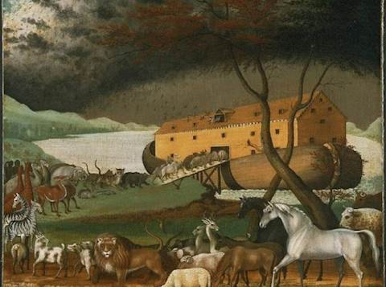

# EscapeRoom "ויברח"

ברוכים הבאים ל"ויברח" חדר בריחה וירטואלי באווירה תנכית.
תחילה תבחרו סיפור ותקראו מעט על הרקע שלו.
על מנת לברוח מהחדר בהצלחה תצטרכו לפתור את כל החידות.
לרשותכם רמזים הפזורים בחדר ובעזרתם תוכלו לפתור את החידות.
תצטרכו לעבור בין חדרים ולפתור את כל החידות עד שתגיעו לחדר הסופי ותסיימו את המשחק לאחר שצברתם המון ידע על סיפורי התנ"ך המרתקים.
בהצלחה!!
יוצרות:  נעמה הרטוב, מוריה ממן  ועטרה זוהר.

מסך בו מסופר בקצר  על תחילת סיפור נוח, משם מועברים אל החדר עצמו

מסך חדר הבריחה של סיפור תיבת נח והמבול:

החדר יוביל אותנו לחידות שונות המסבירות את סיפור תיבת נוח והמבול.
😊בסיום פתרון כל החידות של החדר יופיע מסך ובו נדע כי סיימנו את החדר בהצלחה 
  

קישור למשחק:

 

